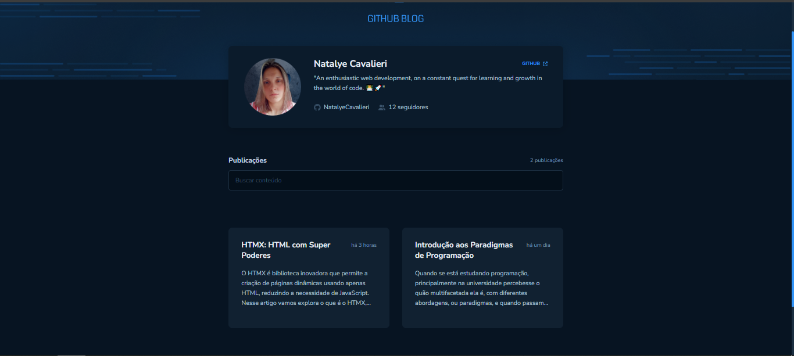

<h1 align="center">GitHub Blog</h1>

  
  

  Este é um projeto de blog que exibe as suas issues do GitHub de forma elegante e interativa. Ele utiliza tecnologias como React, TypeScript e outras para fornecer uma experiência moderna aos usuários.

<h2>Recursos</h2>
<ul>
  <li>Visualização dinâmica e interativa das issues do GitHub.</li>
  <li>Integração com a API do GitHub para buscar e exibir as suas issues.</li>
  <li>Design responsivo para se adaptar a diferentes dispositivos.</li>
</ul>

<h2>Tecnologias Utilizadas</h2>
<ul>
  <li><strong>React:</strong> Biblioteca JavaScript para construção da interface do usuário.</li>
  <li><strong>TypeScript:</strong> Superset JavaScript que adiciona tipagem estática opcional.</li>
  <li><strong>Styled Components:</strong> Biblioteca para estilização de componentes com CSS-in-JS.</li>
  <li><strong>Vite:</strong> Ferramenta de build rápida para projetos modernos de front-end.</li>
  <li><strong>FontAwesome SVG Core:</strong> Biblioteca para trabalhar com ícones SVG da FontAwesome.</li>
  <li><strong>@hookform/resolvers:</strong> Resolvedores para a validação de formulários React Hook Form.</li>
  <li><strong>Axios:</strong> Cliente HTTP baseado em promises para fazer requisições HTTP no navegador e Node.js.</li>
  <li><strong>Moment:</strong> Biblioteca JavaScript para análise, validação, manipulação e formatação de datas.</li>
  <li><strong>Zod:</strong> Validador de esquema TypeScript altamente eficiente e extensível.</li>
</ul>

<h2>Funcionalidade</h2>

  Este projeto permite que você visualize suas issues do GitHub de forma organizada e fácil de entender. Você pode navegar pelas issues, visualizar os detalhes e interagir com elas conforme necessário.

<h2>Como Contribuir</h2>

  Contribuições são bem-vindas! Sinta-se à vontade para enviar pull requests com melhorias, correções de bugs ou novos recursos.

<h2>Licença</h2>

  Este projeto está licenciado sob a Licença MIT - consulte o arquivo <code>LICENSE</code> para obter detalhes.

